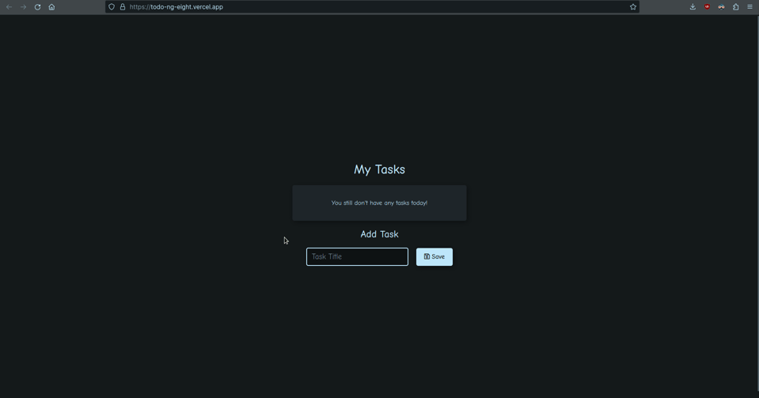
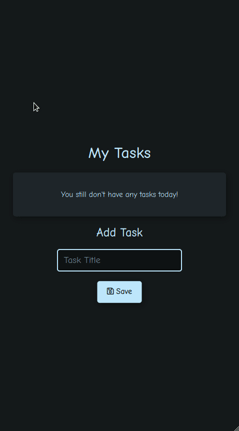

<h1 align="center">
    
    <b>ToDo App</b>
</h1>

## <p>📚 About </p>
A simple application that allows the user to create to-do lists to organize their day or week in a simple and quick way.

## <p>🚀 Technologies Used</p>
This project was built with the following technologies:

-  [Angular](https://angular.io/) v15.2.6
-  [Font Awesome](https://icons.getbootstrap.com/) v4.7.0

## <p>🛠️ How to Use Locally </p>
To clone and run this app, from the command line:

```bash
# Clone this repo
$ git clone https://github.com/lucasferreiraz/todo-ng.git

# Enter the folder
$ cd todo-ng

# Install dependencies
$ npm install

# Start application
$ npm start
```

## <p>📷 [Demonstration](https://todo-ng-eight.vercel.app/) </p>

To access the demo in production [click here](https://todo-ng-eight.vercel.app/).

Desktop                    |  Mobile
:-------------------------:|:-------------------------:
  |  


---

<p align="center" style="font-weight:bolder">
    Developed with 💛 by <a href="https://github.com/lucasferreiraz">Lucas Ferreira</a>
</p>